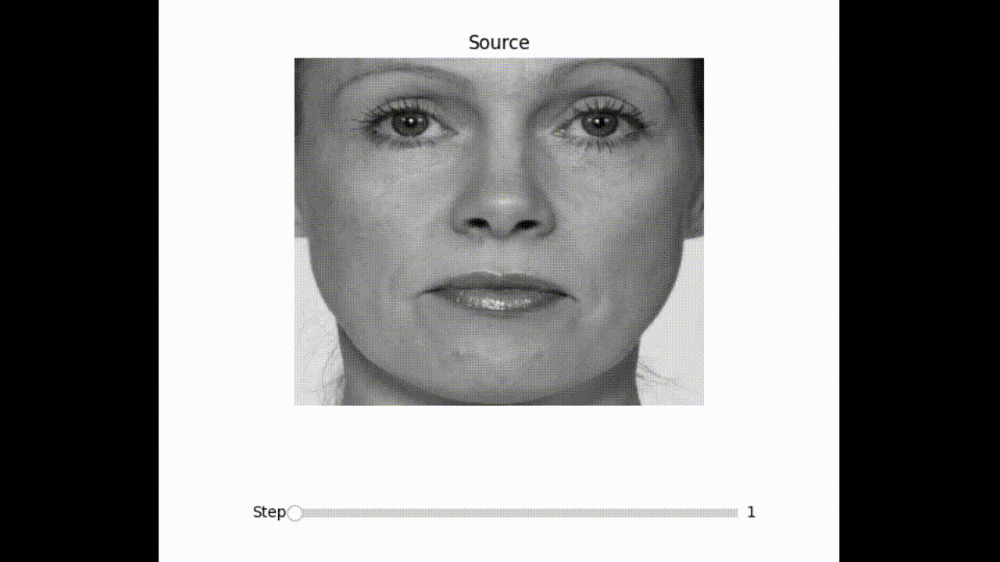

# Face Image Morphing

## Introduction

This project explores the image morphing technique, particularly face image morphing, highlighting its use in animations and potential risks in identity fraud.

We perform image morphing in the frequency. Specifically, we transform the source and target images to frequency domain using DFT and interpolate them to generate the intermediate images.

<p align="center">
    
</p>


This project consists of two major steps: Image Alignment and Transition Control.

The baseline paper on which this work is built: [image morphing in frequency domain](https://link.springer.com/article/10.1007/s10851-011-0273-3)

## Image Alignment

The project introduces an automated approach to align images, significantly enhancing morphing quality. It uses the OpenCV Python module for optimized image processing and facial landmark recognition for feature extraction. Techniques such as rotation to align eyes parallel to the ground and affine transformations to align eyes of source and target images are employed for precise alignment.

<p align="center">
    
</p>

## Transition Control

Transition control is achieved by using the Discrete Fourier Transform (DFT) for transforming images. The project innovates on transitioning images by interpolating their frequency domain representations. It details the approach of using polar interpolation of magnitude and phase of images, a method superior to linear interpolation in spatial domain.

## Results and Evaluation

Demonstrations of the algorithm's performance are provided, comparing with baseline methods. We use metrics like Structural Similarity Index (SSIM) and Peak Signal-to-Noise Ratio (PSNR) for evaluating the quality of morphed images.

## How to Use

The project consists of two main directories:

1. setup/: contains bash files for preparing the conda environment and downloading and preparing the image dataset.
2. src/: contains the main source code for the project

### Running
1. Clone the repository  
```bash
git clone https://github.com/armingh2000/image-morphing.git
```

2. cd to setup/ directory  

```bash
cd image-morphing/setup/
```

3. Prepare the environment and download the dataset  

```bash
chmod +x download_data.sh
./download_data.sh
```

Activate the conda environment  

```bash
conda activate ImgMorph_env
```

4. Set the configs: set the morphing method in src/configs.py  

```python
morph_type = "dft"
# or
morph_type = "dct"
```

set how to show morphing sequence  

```python
show_images(*morphs, path1=paths[0], path2=paths[1])
# or
show_images_slider(*morphs, path1=paths[0], path2=paths[1])
```

5. Run src/main.py to see the results  

```bash
python3 src/main.py
```

<p align="center">
    
</p>

### Producing metrics
To produce the metrics for both DFT and DCT based morphing.

1. Set the configs: configure the number of examples you want to perform the evaluation on

```python
number_of_examples = 2000 # max = 14878
```

2. Generate the stats

```bash
python3 src/stats.py
```

*Statistics are only generated once and the required numbers are saved for future use.*

## Future Work
- [ ] Reduce ghost-like features
- [ ] Explore other alignment methods (beside affine and perspective transformations) that minimize the disfigurement of faces

## License

The source code for the site is licensed under the MIT license, which you can find in the LICENSE file.

---

*This README summarizes the Face Image Morphing. For more detailed information, please refer to the full project report (report.pdf).*

